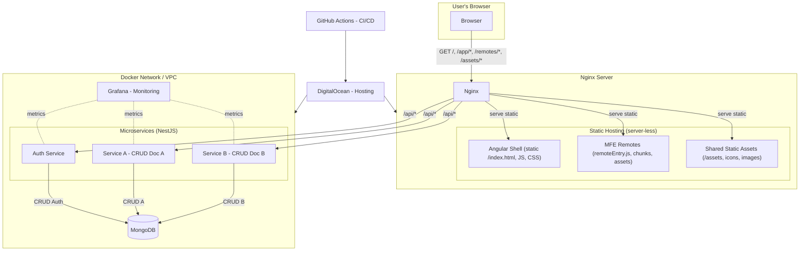

#  Ngx-Workshop.io

Welcome to Ngx-Workshop.io organization 👋

This organization is dedicated to building a modular, scalable platform for **full-stack** web development. Our goal is to empower developers with a hands-on ecosystem that combines Angular micro-frontends, NestJS microservices, MongoDB, and Nginx into a cohesive architecture.

Ngx-Workshop is a **development ecosystem**.


It provides developers with a consistent, scalable way to ***experiment*** with build micro-frontends and microservices while contributing to an ambitious platform for learning web development.

Let's create some tech debt together!

> [!IMPORTANT]
> **Philosophy**
> The Ngx-Workshop organization is not just about building apps.
> It’s about:
> - Teaching through doing.
> - Creating a real-world architecture that developers can learn from.
> - Focusing on practical skills over theoretical knowledge.


## Overview

Ngx-Workshop is an ecosystem built on a **poly-repo** pattern that combines:

- [**Angular**](https://angular.dev/) (with Module Federation) for micro-frontends (MFEs)
- [**NestJS**](https://nestjs.com/) microservices for backend APIs
- [**MongoDB**](https://www.mongodb.com/) for data persistence
- [**Nginx**](https://nginx.org/) as a reverse proxy
- [**Docker & Docker Compose**](https://docs.docker.com/) for containerization
- [**GitHub Actions**](https://github.com/features/actions) for CI/CD pipelines
- [**DigitalOcean**](https://www.digitalocean.com/) for hosting infrastructure
- [**Grafana**](https://grafana.com/) for monitoring and logging

### Quick install (clone all repos)

> Clone & install everything into a single workspace folder.

```bash
# 1) Create and enter your workspace folder
mkdir -p ~/NGX-WORKSHOP-ORG && cd ~/NGX-WORKSHOP-ORG

# 2) Download the installer script from the org profile
curl -fsSL \
  https://raw.githubusercontent.com/Ngx-Workshop/.github/main/profile/clone-and-install.sh \
  -o clone-and-install.sh

# (Alternatively)
# wget -qO clone-and-install.sh \
#   https://raw.githubusercontent.com/Ngx-Workshop/.github/main/profile/clone-and-install.sh

# 3) Make it executable and run it
chmod +x ./clone-and-install.sh
./clone-and-install.sh
```

This ecosystem is designed to support both **structural micro-frontends** (headers, footers, navigation) and **user journey MFEs**, as well as a consistent backend service pattern with clearly defined **bounded contexts**.

---

## Getting Started

### Seed Repositories

To start creating MFEs and Services, please begin with the seed repositorie's `README` files:
- **MFE Remote Seed**: https://github.com/Ngx-Workshop/seed-mfe-remote
- **NestJs Service Seed**: https://github.com/Ngx-Workshop/seed-service-nestjs

Each seed repository contains detailed onboarding docs to help you get productive quickly.

---

## Architecture



### Microservices
- Each NestJS microservice is responsible for **CRUD operations on a single MongoDB document type**.
- No two services should manipulate the same document.
- Services communicate over **internal VPC IPs** using RESTful HTTP (TCP support is being planned).
- Authentication/Authorization is handled by a dedicated service that also provides an **NPM package with NestJS guards**.
- All services run in Docker containers managed with **Docker Compose**, and are exposed via **Nginx reverse proxies**.
- A **seed repository** exists to guide developers through creating new services, running them locally, and following architectural patterns.

### Frontend
- Angular applications use **Module Federation** to create MFEs.
- MFEs are categorized into:
  - **Structural MFEs**: header, footer, navigation, etc.
  - **User Journey MFEs**: feature-driven applications that determine which structural MFEs to render.
- A dedicated **MFE seed repository** provides examples and onboarding instructions for creating new MFEs.

### MCP Server For Journeys

The future vision is to build an **[MCP (Model Context Protocol)](https://modelcontextprotocol.io/docs/getting-started/intro)** helps with learning **Web Development**.
Users will progress through:
- **Assessment tests**
- **Interactive workshops**
- **Continuous workshop loops**

Thanks to the MFE architecture, the system dynamically adapts what is shown to the user, moving beyond traditional static navigation toward a more **agent-driven, personalized journey**.

---

## 🤝 Contributing

We welcome contributions from developers of all levels. The most important thing is to follow the established architectural guidelines and keep services and MFEs consistent.

- Follow the **bounded context rules** for microservices.
- Keep MFEs clearly scoped (structural vs user journey).
- Don't nest MFEs within MFEs.
- Use the provided seeds for new services or MFEs.
- When adding new repos, consider updating the org installer script if the repo should be part of the default workspace.
